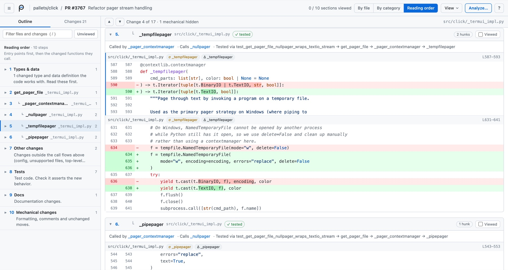

<p align="center">
  
</p>

<p align="center">
  <a href="https://github.com/sshah03/perspica/actions/workflows/ci.yml"></a>
  <a href="https://crates.io/crates/perspica"></a>
  <a href="https://github.com/sshah03/perspica/releases/latest"></a>
  <a href="LICENSE"></a>
</p>

<p align="center"><b>Review code changes by what they do, not line by line.</b></p>

perspica reads a diff the way a careful reviewer would. It parses both sides, works out what actually changed (a rename, a new parameter, a moved function, a real logic change), sets aside the mechanical noise (reformatting, comments, rename-only lines, unchanged moves, generated files), and points at what a plain diff hides: references to names that no longer exist, calls that weren't updated for a new signature, code left unused.

None of that needs a model. perspica parses both versions with tree-sitter and follows the calls between them, so it's one local binary that answers in a few hundred milliseconds on a typical PR, gives the same answer every time, and needs no API key. An LLM is an optional extra: it groups the changes by intent, rates the risk of each group and writes a summary, and nothing leaves your machine unless you ask for it.

It understands **TypeScript and JavaScript** (including TSX and JSX), **Python**, **Rust**, **Go**, **Java**, **Kotlin**, **Scala**, **C#**, **C**, **PHP** and **Ruby** (Rails included). Files in other languages still show up, as ordinary line diffs.

It's built for reviewing work done with coding agents. When the change came from your Claude Code or Codex session, perspica shows what you asked for in your own words and, with an LLM, marks which parts you asked for and which the agent decided on its own.

<a href="docs/media/perspica-demo.mp4"></a>

<sub>Reviewing [colinhacks/zod#6587](https://github.com/colinhacks/zod/pull/6587) (intent, checks, split view), [pallets/click#3767](https://github.com/pallets/click/pull/3767) (reading order, analysis, terminal) and [charmbracelet/bubbletea#1801](https://github.com/charmbracelet/bubbletea/pull/1801) (noise). The agent-session example is illustrative. [Full-quality video (MP4)](docs/media/perspica-demo.mp4).</sub>

**[See it on real pull requests](https://sshah03.github.io/perspica/)** from ripgrep, Flask, Spark and more. Nothing to install.

## Install

```bash
brew install sshah03/perspica/perspica
```

Or with the install script, which puts the binary in `~/.local/bin`:

```bash
curl -fsSL https://raw.githubusercontent.com/sshah03/perspica/main/install.sh | sh
```

Or with Cargo (`cargo install perspica`), or download a binary for macOS, Linux or Windows from [Releases](https://github.com/sshah03/perspica/releases), or build from source:

```bash
git clone https://github.com/sshah03/perspica && cd perspica
cargo build --release          # → target/release/perspica
```

## Use

Inside a repository:

```bash
perspica                 # review your current branch: commits, uncommitted and untracked files
perspica --web           # …in the browser
perspica --pr 123 --web  # a GitHub pull request (uses the `gh` CLI)
```

Other targets:

```bash
perspica --branch develop                 # against another base branch
perspica --staged                         # staged changes
perspica --git main...feature             # a range (merge-base, like a PR)
perspica --git HEAD~3                     # the working tree against a commit
perspica old.ts new.ts                    # two files
perspica --json                           # machine-readable output
perspica --pr 123 --format html           # the viewer as one file to share, with any saved analysis
```

Everything above works on its own. The optional LLM analysis (`-s`, or **Analyze…** in the viewer) runs through Claude Code, an API key or Ollama; see [LLM analysis](#llm-analysis) for setup.

## What you get

**Noise set aside.** Formatting, comment-only edits, lines that differ only by a rename, code moved unchanged, generated and vendored files are tagged and collapsed, so the lines that carry real changes stand out. Tests and docs are their own tier.

**Every change named.** Renames (even when the body was also edited), signature changes (new required vs. optional parameters), dependency changes per module and symbol, extractions into new functions, moves within and across files, logic changes per function and method.

**What a diff hides.**
- a renamed or removed name still used anywhere in the repository (for a method, only calls on its own type, so a common name like `Flush` doesn't raise false alarms);
- calls to a changed function that weren't updated (only for changes that can actually break a caller);
- code the change left unused.

**A reading order.** Changed code from the entry points down to the changed functions they call (the order you'd want someone to walk you through it), and which of them the changed tests actually reach, with the call path.

<picture>
  <source media="(prefers-color-scheme: dark)" srcset="docs/images/reading-order-dark.jpg">
  
</picture>

**What you asked for.** If the change was made with Claude Code or Codex, perspica shows your prompts from the sessions that edited these files. With an LLM analysis, each group of changes is marked *asked*, with a short quote checked word for word against your prompts, or *agent's call*: the agent decided it on its own. Those are the ones to look at first.

**Intent, risk and a summary (optional).** With an LLM, changes are grouped by what they're for, each with a risk level and what to verify, plus a summary and the model's notes. Those are kept apart from what perspica found in the code, and labeled as less certain.

## LLM analysis

Optional. `-s` in the terminal, or **Analyze…** in the viewer (with a model picker and a *Standard* or *Thorough* depth).

**Setup.** There's no key to paste anywhere. perspica uses whichever of these you have:

- **Claude Code.** perspica uses your Claude Code login, so no API key is needed; if you already use it, there's nothing to set up. New to it? Install [Claude Code](https://claude.com/claude-code) and run `claude auth login`.
- **An API key** in your environment. Add it to your shell profile (`~/.zshrc`, `~/.bashrc`) and open a new terminal:
  ```bash
  export ANTHROPIC_API_KEY=sk-ant-…     # or OPENAI_API_KEY
  ```
- **A local model with Ollama.** Install [Ollama](https://ollama.com), download a model and keep Ollama running:
  ```bash
  ollama pull gemma4:12b      # about 16 GB of RAM; qwen3-coder:30b with 32 GB
  ```
  perspica picks the best model you've downloaded (or choose one in the viewer, or with `--model`). Local models are slower and less precise than hosted ones: about a minute for a 10-file PR on an M4 Pro. `OLLAMA_HOST` points it at another machine.

If none is found, **Analyze…** in the viewer shows these steps, and *Check again* picks up a Claude Code login or Ollama without restarting. When there are several, the order is `--api-key` / `--provider` or `PERSPICA_API_KEY` (and `PERSPICA_PROVIDER`), then `ANTHROPIC_AUTH_TOKEN` (gateways), `ANTHROPIC_API_KEY`, `OPENAI_API_KEY`, Claude Code, Ollama; `--provider ollama` picks the local model over the rest. Prefer the environment to `--api-key`, which leaves the key in your shell history.

The default Claude model is `claude-opus-5-5`; `--model claude-sonnet-5-5` is faster, `claude-haiku-5-5` (or the older `claude-haiku-4-5`) is a quick first pass. What's sent: the list of classified changes and the changed code, never whole files (Thorough may also read definitions and files under 200 lines from the changed files). Analyses are saved per diff in `.git/perspica/`, so reloading or running again doesn't pay for the same analysis twice; `--fresh` reruns. Up to 100,000 characters of changed code are sent (16,000 to a local model). For a bigger change, **Analyze…** says how big it is and offers to send all of it, and `--full-context` does the same in the terminal; otherwise the model is told which files it can't see.

## Privacy

- Everything runs locally. Nothing is sent anywhere without `-s` / **Analyze…**, and with Ollama, not even then.
- Agent sessions (`~/.claude/projects`, `~/.codex/sessions`) are read only for **your own** changes (uncommitted work, or commits authored with your git identity), never for someone else's PR. perspica says when it uses them; `--no-sessions` turns this off.
- The web viewer listens on `127.0.0.1` and only answers its own page: other hosts (DNS rebinding) and other sites' requests are refused.

## Languages and file roles

The semantic analysis covers TypeScript and JavaScript, Python, Rust, Go, Java, Kotlin, Scala, C#, C, PHP and Ruby. Every other file is shown as a line diff, with syntax highlighting where available, whitespace-only changes collapsed and its role (test, docs, generated…).

File roles come from paths and codegen markers; override them in `.gitattributes` with `linguist-generated`, `linguist-vendored`, `linguist-documentation`, or `perspica-role=source|test|docs|generated|vendored`.

<details>
<summary><b>Command-line reference</b></summary>

```
Usage: perspica [OPTIONS] [OLD_FILE] [NEW_FILE]

Arguments:
  [OLD_FILE]  Old file path
  [NEW_FILE]  New file path

Options:
  -l, --language <LANGUAGE>  Override language detection
  -f, --format <FORMAT>      Output format: tty (default), json, web, html (the viewer saved as one file, see --out) [default: tty]
      --out <OUT>            Where --format html writes the page [default: perspica-review.html]
      --json                 Shorthand for --format json
      --web                  Open results in browser
      --port <PORT>          Port for web viewer (the next free port is used if taken) [default: 7890]
      --no-open              Don't open a browser tab (web mode)
      --no-color             Disable colored output
      --show-noise           Show mechanical changes (formatting, renames, moves) in full in the terminal
      --staged               Diff staged changes
      --git [<GIT>]          Diff working tree against HEAD, or specify a commit range (a..b, a...b, or a ref)
      --pr <PR>              Review a GitHub pull request by number (uses the `gh` CLI)
      --branch [<BASE>]      Review the current branch against its merge-base with <BASE> (default: origin/HEAD, main or master). What `perspica` does with no arguments
  -s, --summarize            Group changes by intent, with risk and a summary, using an LLM. Sends the change list and changed code, never whole files
  -d, --deep                 Thorough analysis: the LLM may first read definitions and small files from the changed files. Slower. Implies -s
      --api-key <API_KEY>    LLM API key (better: set it in the environment, see the README)
      --provider <PROVIDER>  With --api-key: anthropic (default) or openai. `ollama` needs no key and uses a local model
      --model <MODEL>        Model to use instead of the provider's default
      --no-sessions          Don't read the Claude Code or Codex sessions behind your change (your prompts are shown, and sent with -s). Never read for other people's changes
      --fresh                Run the LLM analysis again even if a saved one matches this diff
      --full-context         Send all of the changed code to the LLM, however large. By default perspica sends up to 100,000 characters (16,000 for local models)
  -h, --help                 Print help
  -V, --version              Print version
```

Viewer shortcuts: `j`/`k` next/previous change · `n`/`p` next/previous file or group · `v` mark viewed and go to the next unviewed file · `f`/`i`/`r` by file / by intent / reading order · `m` show/hide mechanical changes · `u`/`s` unified/split · `/` filter · `?` all shortcuts.

</details>

<details>
<summary><b>How it works</b></summary>

`perspica-core` is a library with no I/O: source strings in, structured results out. It parses both sides with tree-sitter, fingerprints every item (token-level hashes that ignore formatting and comments), matches items across versions (by name, by shape for renames, by similarity for renamed-and-edited ones), classifies the differences, then links display hunks to them and tags the mechanical lines. Cross-file passes find moves between files, names that vanished, affected call sites, and a call graph (by name, gated on the caller importing the callee's module) for the reading order and test reach.

`perspica` (the CLI) collects the change from git (one `git diff` and one `git cat-file --batch`), renders it to the terminal, JSON or the embedded web viewer, and runs the optional LLM analysis, whose output is checked against perspica's own analysis (unknown entries dropped, "asked" quotes checked against the actual prompts).

```
crates/perspica-core/src   parser · diff · classify · cross_file · annotate · roles · flow · languages/
crates/perspica-cli/src    main · git · sessions · intel · llm · deep · web · render_tty
crates/perspica-cli/web    the viewer (no build step)
tests/fixtures             change-type fixtures, and real PRs from other projects (tests/fixtures/real)
```

Development: `cargo test` runs everything, including real pull requests from [Flask](https://github.com/pallets/flask/pull/5928) and [ky](https://github.com/sindresorhus/ky/pull/881) as fixtures.

</details>

## License

MIT
